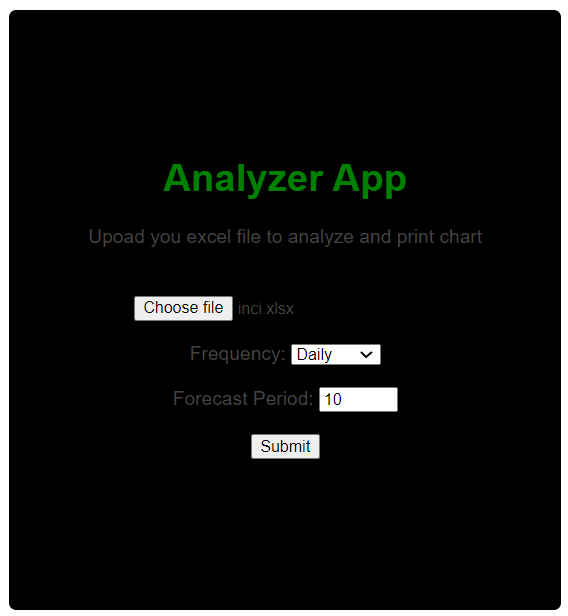
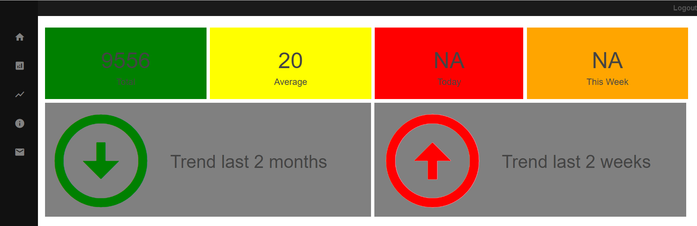
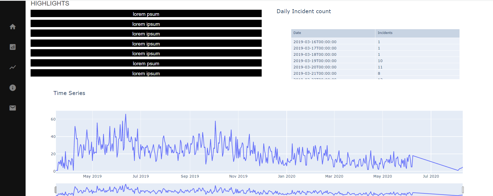
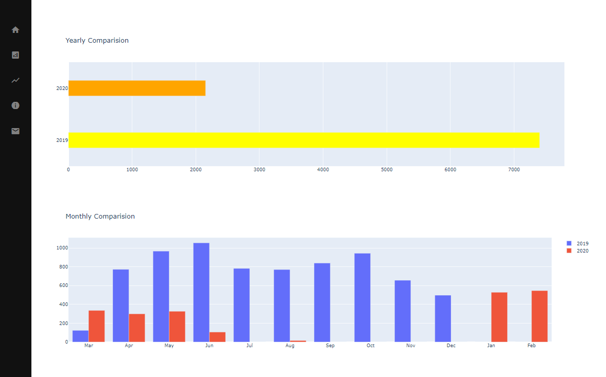

# Analytics Dashboard

This application is deloped using Python Flask framework to provide a analytics dashboard from the timeseries provided.

Below is the homepage, you ay upload the the data file for timeseries data 

You can upload the file in below window and choose the period of data. FOrecasting is still under development

The dashboard provides the scorecards and trend from the data

It shows the highligts and actual data and displays the full time series

It shows comaprision over different time frames

